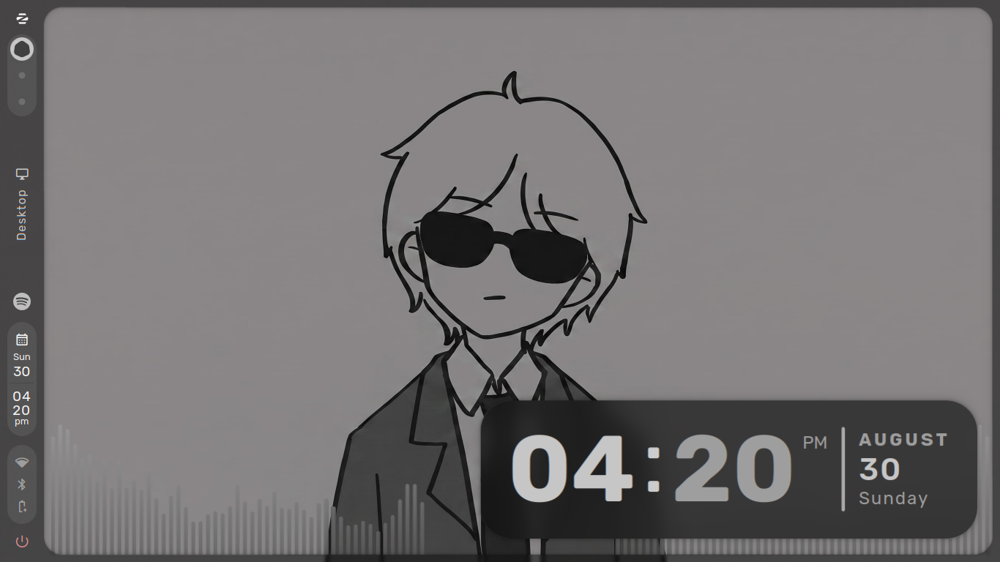
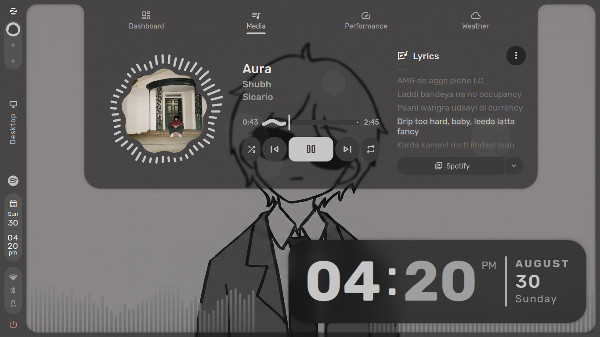
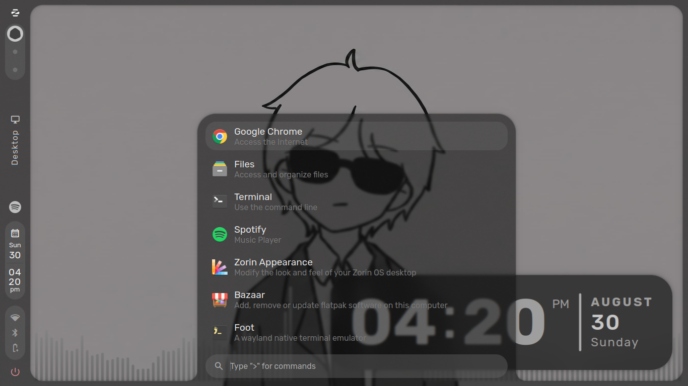
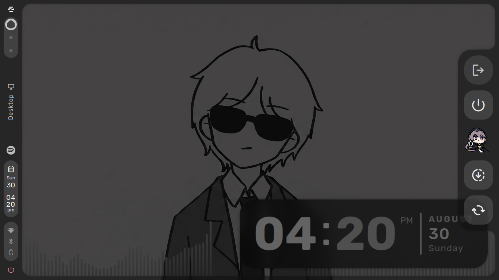

# caelestia-ubuntu

**Caelestia Shell (Quickshell) + Hyprland, on Ubuntu 24.04 / Zorin OS 18 / Mint 22 / Pop!_OS 22.04 — one script, zero manual config.**

Caelestia officially supports Arch-based distros only. This repo backports the
full experience to Ubuntu-family systems: it builds Quickshell and the
Caelestia shell from source against a pinned Qt 6.11.2 (the same Qt version
Arch currently ships, which is what Caelestia upstream develops against),
installs every dependency, and deploys the maintainer's exact desktop —
theme, panels, animations, wallpapers, fonts, idle/lock behaviour — as a
**side-by-side session**. GNOME stays completely untouched.

```
./setup.sh
```
That's it. Reboot, pick **Hyprland** in the GDM gear menu, log in.

---

## Screenshots

This is what you get on the first login — no tweaking required.

| | |
|---|---|
|  |  |
| *Desktop — wallpaper, bar, visualiser* | *Dashboard — quick toggles, system info* |
|  |  |
| *Launcher — apps, `>` actions, `>wallpaper` picker* | *Session — logout / reboot / shutdown* |

The whole UI (bars, drawers, lock screen, OSD) recolours itself from the
wallpaper — switch it with `>wallpaper` in the launcher or
`caelestia wallpaper -f <file>`.

## What you get

Exactly the setup running on the maintainer's machine:

| Area | Details |
|---|---|
| Theme | Rubik / CaskaydiaCove NF / Material Symbols Rounded, transparency 0.55 base / 0.42 layers, rounding 1.35 |
| Background | animated wallpaper layer with blurred desktop clock (bottom-right, scale 1.15) + 51-bar audio visualiser (blurred, auto-hide) |
| Bar | custom entry order (logo → workspaces → active window → tray → clock → status → power), hover-reveal, scroll actions |
| Animations | global duration scale 1.4, smooth bezier window animations |
| Idle/lock | 3 min lock → 5 min dpms off → 10 min suspend-then-hibernate, audio-aware inhibition, fingerprint unlock via quickshell PAM |
| Resume | shell auto-bounce + automatic lock re-acquisition after lid open (systemd-sleep hooks included) |
| Keybinds | SUPER-centred workflow incl. resize submap, hyprshot screenshots, wlogout, launcher/drawer IPC |

Full list of what gets installed:
- Qt 6.11.2 toolchain → `/opt/qt611` (aqtinstall, includes qtimageformats/webp + shadertools)
- wayland 1.26 → `/usr/local` (Qt 6.11's Wayland private headers need the `wl_fixes` type, which Ubuntu 24.04's wayland 1.22 lacks; the newer wayland is ABI-compatible, so GNOME and system packages are unaffected)
- Hyprland 0.56.x + hyprlock/hypridle/hyprpaper + portals (PPA `ppa:cppiber/hyprland`)
- Quickshell (git master), built with vendored cpptrace, RPATH-baked so no global `LD_LIBRARY_PATH` is ever needed
- Caelestia shell (git master) → QML tree in `~/.config/quickshell/caelestia`, plugin in `/lib/qt6/qml/Caelestia`
- m3shapes (Material 3 shapes) + libcava (audio visualiser backend)
- caelestia CLI (via uv/pipx), all fonts, Chrome + Bazaar flatpaks (best effort)

## Requirements

- Ubuntu 24.04+ or derivative (Zorin 18, Mint 22, Pop!_OS 22.04), x86_64
- ~8 GB free disk space (Qt toolchain ≈ 1.5 GB, build caches ≈ 2 GB)
- Working internet, sudo access
- A GPU with Mesa graphics drivers (any Intel iGPU from Haswell up, AMD, NVIDIA with mesa/nouveau; proprietary NVIDIA works but is untested here)

## Usage

```bash
git clone https://github.com/<you>/caelestia-ubuntu.git
cd caelestia-ubuntu
./setup.sh            # interactive; --yes for unattended
```

Flags:

| Flag | Effect |
|---|---|
| `--yes` | no confirmation prompts |
| `--skip-apt` | skip package stage (re-runs) |
| `--skip-qt` | Qt already installed |
| `--skip-fonts` | skip font downloads |
| `--skip-config` | build only; do not touch `~/.config` |
| `--qt-version X` | different Qt (must be ≥ 6.11) |

The installer is **idempotent** — re-running it updates sources and rebuilds.
Existing user configs are backed up to
`~/.config/caelestia-ubuntu-backup-<timestamp>` before anything is overwritten.

## Update

```bash
git -C ~/.cache/caelestia-ubuntu-build/quickshell pull
git -C ~/.config/quickshell/caelestia pull
# then re-run ./setup.sh --skip-apt --skip-qt
```

## Uninstall

```bash
./uninstall.sh             # everything except Qt
./uninstall.sh --purge-qt  # also remove /opt/qt* (~2 GB freed)
```
User configs are preserved at `~/.config/caelestia-ubuntu-uninstalled-<date>`.
GNOME is never modified by either script.

## Why Qt 6.11?

Caelestia master (v2.4.0+) uses `DoubleSpinBox` from QtQuick.Controls, which
exists only in **Qt ≥ 6.11** — Ubuntu 24.04's Qt 6.4 is far too old, which is
why distro Qt doesn't work. Qt 6.11.2 is also the exact version Arch currently
ships, so your shell runs on the Qt upstream actually tests against. Note that
Qt 6.11 additionally requires wayland ≥ 1.24 headers (see install list).
Older releases of this setup patched Caelestia for Qt 6.9; that patch layer
is gone.

## Troubleshooting

- **Black screen at login / no bar**: check `systemctl --user status caelestia-shell`
  and `journalctl --user -u caelestia-shell -e`.
- **`qs` IPC binds do nothing**: make sure no global `LD_LIBRARY_PATH` is set
  pointing at an old Qt; the binary's baked RPATH handles Qt resolution.
- **`hyprctl configerrors` shows nothing but things look off**: run
  `hyprctl reload`.
- **Lock screen doesn't appear after lid resume**: the sleep hooks need the
  user id — if your uid isn't 1000, edit `/usr/lib/systemd/system-sleep/caelestia-relock-marker.sh`.
- **Missing Calculator action in launcher**: `sudo apt install qalculate` (the
  `qalc` CLI, not just the library).
- Wayland-native Qt 6.11 apps and GNOME apps are unaffected by this install;
  only `qs` uses the `/opt/qt611` toolchain.

## Licenses

Repo scripts: MIT. Installed upstream components keep their own licenses —
see `LICENSE`.
