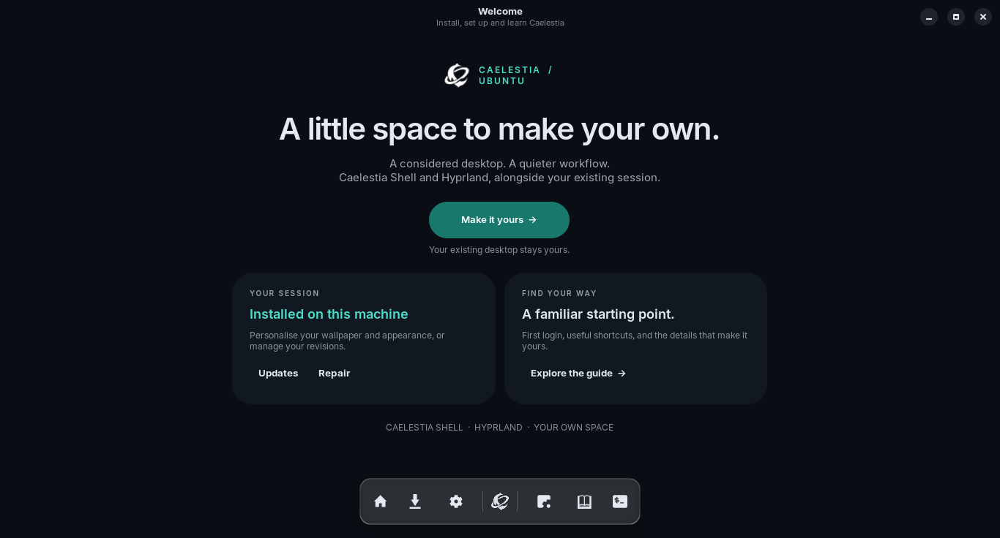

<p align="center">
  
</p>

# Caelestia for Ubuntu — the app

A graphical installer, setup assistant and built-in user guide for the
[caelestia-ubuntu](https://github.com/12errh/caelestia-ubuntu) project.
Users never need to open a terminal: the app runs the repository's
`setup.sh` / `update.sh` / `uninstall.sh` for them, with live progress,
sudo password handling, a wallpaper picker, starter settings and the full
keybind/guide reference.



## Run it

### Easiest: install from a release (.deb)

Download the `.deb` from the
[latest GitHub Release](https://github.com/12errh/caelestia-ubuntu/releases/latest)
and install it:

```bash
sudo apt install ./caelestia-installer_*_all.deb
# then launch "Caelestia for Ubuntu" from the applications menu
```

### From a clone (no install step)

```bash
./app/run.py              # GUI
./app/run.py --check      # headless system report (no GTK needed)
```

### Install script (from a clone)

Or install it into the app grid with the script (system-wide, or `--user`
for current user only):

```bash
sudo ./app/install.sh          # installs launcher + icon + repo copy
# then launch "Caelestia for Ubuntu" from the applications menu
```

Runtime requirements: `python3-gi`, `gir1.2-gtk-4.0`, `gir1.2-adw-1`
(standard on Ubuntu 24.04 / Zorin 18 GNOME; `app/install.sh` and the .deb
declare them). GTK4 + libadwaita are available on the stock GNOME desktop
*before* Caelestia/Qt exists, which is why the app uses them. Full details
in [docs/INSTALL_APP.md](../docs/INSTALL_APP.md).

## What each tab does

| Tab | Purpose |
|---|---|
| **Welcome** | Status snapshot (installed or not, service running?) and quick entry points. |
| **Install** | 5-step wizard: system checks → install options → sudo password → live progress log → result. Runs `setup.sh` with your chosen flags. Re-running is a safe repair. |
| **Setup** | Post-install assistant: status, wallpaper picker (with thumbnails), starter settings (transparency, rounding, animation speed, font scale, idle/lock timers), restart shell, uninstall. |
| **Updates** | Runs `update.sh --check` (read-only) and shows installed vs pinned vs upstream per component. *Apply updates* (enabled only when something differs from the pin) runs `update.sh --yes`. **Advanced — latest upstream** jumps every component to the newest upstream commit and rebuilds, then lets you *Mark tested & keep* (records the new known-good pins) or *Revert to previous* (restores the snapshot and rebuilds). Pin snapshots live in `~/.local/share/caelestia-ubuntu/pins`; configs and `shell.json` are never overwritten (they're snapshotted first). |
| **Guides** | The full user guide: first login, every keybind, wallpaper & dynamic colours, idle/lock behaviour, updating, troubleshooting. |
| **Advanced** | Directly run `update.sh` / `uninstall.sh [--purge-qt]` / `update.sh --check` with the same live log. |

## How it runs the scripts

The scripts refuse to run as root (they need your real `$HOME`), so the
app launches them on a **pseudo-terminal** as your user. When sudo
prints its `password for …:` prompt, the app writes the password you
entered on the wizard's auth page (or the password prompt shown when you
start a privileged action from Setup/Updates/Advanced) into the PTY —
exactly like typing it in a terminal. Before a privileged action the
password is validated with `sudo -S -k -v`; if sudo already has a cached
credential no prompt is needed. The password lives only in app memory: it
is never written to disk or logs. The live log shows everything the
scripts print, and stage headers (`==> stage: …`) drive the progress bar.

Settings in the Setup tab write to `~/.config/caelestia/shell.json`
(the file the Caelestia shell watches), preserving all other keys — the
shell applies changes live.

## Layout

```
app/
├── run.py                     # launcher from a clone
├── install.sh                 # system/user install of the app itself
├── data/
│   ├── io.github.CaelestiaUbuntu.Installer.desktop
│   └── io.github.CaelestiaUbuntu.Installer.svg
└── caelestia_installer/
    ├── main.py                # window shell + sidebar navigation
    ├── cli.py                 # --check headless mode
    ├── checks.py              # pre-flight checks + installed-state detection
    ├── runner.py              # PTY script runner with sudo auto-answer
    ├── paths.py               # repo/script/config path resolution
    ├── ui.py                  # shared GTK helpers
    └── pages/
        ├── welcome.py         # status + entry points
        ├── install.py         # install wizard (carousel + checks)
        ├── setup.py           # wallpaper, settings, maintenance
        ├── updates.py         # revision drift report + apply
        ├── guides.py          # built-in user guide content
        ├── advanced.py        # run repository scripts directly
        └── script_panel.py    # shared live-log/progress widget
```

## Development notes

- No third-party Python packages — stdlib + PyGObject only.
- `paths.repo_root()` finds the repo when running from a clone, from the
  installed layout (`/usr/local/share/caelestia-installer/repo`), or via
  the `CAEL_REPO_DIR` environment variable (what `install.sh`'s launcher
  sets and CI can use).
- The installer is **idempotent**: "Repair / reinstall" is a supported
  re-run; existing user configs are backed up by `setup.sh` itself.
